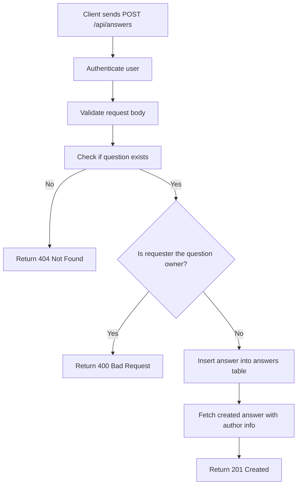
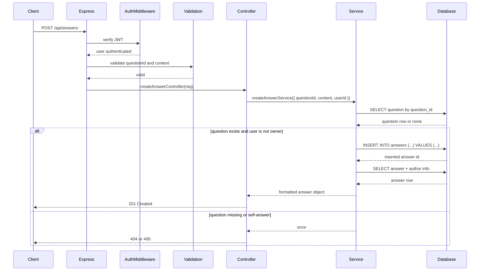
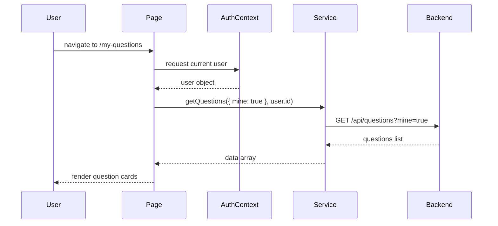

# Brief: Create Answer (T-12)

## Purpose

This brief explains how the Create Answer feature works in the forum system. It shows how an authenticated user can post an answer to a question, while the backend blocks the user from answering their own question.

## Endpoint Summary

- Method: POST
- URL: /api/answers
- Access: Protected
- Auth: Bearer JWT required
- Purpose: Create a new answer for an existing community question

## Main Files

- backend/src/api/answer/routes/answer.route.js
- backend/src/api/answer/controller/answer.controller.js
- backend/src/api/answer/service/answer.service.js
- backend/src/api/answer/validations/answer.validation.js
- backend/src/middleware/authentication.js
- backend/db/schema.sql

## Request Example

### Request body

```json
{
  "questionId": 1,
  "content": "You can connect React to Express by creating an API route and calling it from the frontend."
}
```

### Success response

```json
{
  "success": true,
  "message": "Answer posted successfully",
  "data": {
    "id": 1,
    "questionId": 1,
    "content": "You can connect React to Express by creating an API route and calling it from the frontend.",
    "createdAt": "2026-04-20T12:00:00.000Z",
    "updatedAt": "2026-04-20T12:00:00.000Z",
    "author": {
      "id": 2,
      "firstName": "Chala",
      "lastName": "T"
    }
  }
}
```

## How the Flow Works

### 1. Authentication

The request first passes through the authentication middleware.

- If no valid token is provided, the request is rejected.
- If the token is valid, the user ID is attached to req.user.id.

This ensures that only logged-in users can create answers.

### 2. Validation

Before the controller runs, the validation layer checks the body.

- questionId must be present and must be an integer.
- content must be present and must contain at least 20 characters.

If validation fails, the request stops with a validation error response.

### 3. Controller

The controller receives the request and forwards the data to the service layer.

It passes:

- questionId
- content
- userId from the authenticated user

### 4. Service Logic

The service performs the core business rules.

1. It checks whether the referenced question exists.
2. If the question does not exist, it throws a not-found error.
3. If the authenticated user is the owner of that question, it rejects the request.
4. If everything is valid, it inserts the answer into the answers table.
5. It retrieves the newly inserted answer and returns it in a formatted structure.

## Business Rules

The feature enforces two important rules:

- A user cannot answer their own question.
- A user must provide a meaningful answer body with at least 20 characters.

## Error Cases

- 401 Unauthorized: user is not logged in
- 400 Bad Request: user tries to answer their own question
- 404 Not Found: question does not exist
- 422/400 Validation Error: invalid questionId or short content

## Flow Diagram



## Sequence Diagram



## What Each Layer Does

### Route layer

The route file registers the POST endpoint and applies:

- authentication middleware
- validation middleware
- controller handler

### Controller layer

The controller is lightweight. It extracts the request body and delegates the real work to the service.

### Service layer

This is the main business logic layer.

It checks:

- whether the question exists
- whether the current user is the owner
- whether the answer can be inserted safely

### Validation layer

This layer is responsible for input quality and prevents bad requests before they reach the database.

## Database Role

The answer is stored in the answers table with at least:

- question_id
- user_id
- content
- created_at
- updated_at

After insertion, the service fetches the answer together with the author’s name from the users table.

## Why This Design Is Useful

- It keeps the controller thin and focused on HTTP handling.
- It centralizes the business logic in the service layer.
- It prevents invalid or abusive actions such as self-answering.
- It makes the response consistent for the frontend.

## Quick Implementation Checklist

- [ ] Route is registered for POST /api/answers
- [ ] Authentication middleware is applied
- [ ] Request validation is active
- [ ] Controller forwards the request to the service
- [ ] Service checks question existence
- [ ] Service blocks self-answering
- [ ] Answer is inserted into the database
- [ ] The created answer is returned with author details

- `backend/src/api/questions/service/question.service.js`
  - if `mine` is true, adds `q.user_id = ?` filter
  - returns only questions authored by the current user

## User experience

- The page is a private dashboard for the user's contributions.
- It encourages continued participation with a `+ New question` button.
- Clicking a card opens the question details page.
- The UI uses consistent styling and avatar behavior with other pages.

## Why this page matters

- It gives users ownership over their content.
- It helps them manage, review, and revisit their published questions.
- It reinforces the authenticated experience by showing only personal data.

## Diagram: sequence



## Implementation checklist

- [x] Page is mounted on `/my-questions`
- [x] Protected route requires authentication
- [x] Uses `AuthContext` to get current user
- [x] Calls `getQuestions({ mine: true }, user.id)`
- [x] Handles loading, empty, and list states
- [x] Navigates to details and ask-new-question pages
- [x] Displays author avatar or fallback initials

---

This brief explains how the My Questions page works and how it integrates with the question list API.
