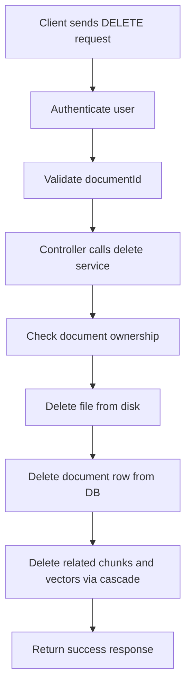

# Detailed Document: Delete RAG Document and My Questions Page

## 1. Delete RAG Document (`T-24`)

### Overview
The delete RAG document feature removes a user-uploaded PDF from the RAG knowledge base. It deletes the file from disk and removes all related database records so the document no longer contributes to semantic search or AI grounding.

### Endpoint
- Method: `DELETE`
- Route: `/api/rag/documents/:documentId`
- Access: Protected (requires authentication)

### Main Files
- `backend/src/api/rag/routes/rag.routes.js`
- `backend/src/api/rag/controller/rag.controller.js`
- `backend/src/api/rag/service/rag.service.js`
- `backend/src/api/rag/validation/rag.validation.js`
- `backend/src/middleware/authentication.js`
- `backend/db/schema.sql`

### How it works
1. The request reaches the RAG route.
2. Authentication middleware verifies the JWT token.
3. The route parameter `documentId` is validated.
4. The controller calls the delete service with the authenticated user ID.
5. The service checks whether the document exists and belongs to the current user.
6. The PDF file is removed from storage if it exists.
7. The document record is deleted from the database.
8. Cascade rules remove related chunk and vector data automatically.

### Logic Flow


### Important behavior
- If the JWT is missing or invalid, the request is rejected with `401 Unauthorized`.
- If the document is not found, the request returns `404 Not Found`.
- If the document belongs to another user, the request returns `403 Forbidden`.
- If the file is already missing, the delete still proceeds safely.

### Database cleanup
The `documents` table is linked to child tables using cascade rules:
- `document_chunks` references `documents` with `ON DELETE CASCADE`
- `document_chunk_vectors` references `document_chunks` with `ON DELETE CASCADE`

This ensures that deleting a document also removes its extracted chunks and stored vector embeddings.

---

## 2. My Questions Page (Frontend)

### Overview
The My Questions page displays only the questions written by the currently authenticated user. It gives the user a personal view of their contributions and helps them navigate to their own question details.

### Route and Location
- Route: `/my-questions`
- Page file: `frontend/src/pages/MyQuestions/MyQuestions.jsx`
- Route registration: `frontend/src/App.jsx`

### Main Files
- `frontend/src/pages/MyQuestions/MyQuestions.jsx`
- `frontend/src/pages/MyQuestions/MyQuestions.module.css`
- `frontend/src/services/core/question.service.js`
- `frontend/src/contexts/AuthContext.jsx`
- `frontend/src/App.jsx`

### How it works
1. The user visits `/my-questions`.
2. The route is protected, so the user must be authenticated.
3. The page reads the current user from `AuthContext`.
4. It calls the question service with `mine: true`.
5. The frontend requests `/api/questions?mine=true`.
6. The backend returns only questions created by the current user.
7. The page renders them as cards with title, preview, metadata, and avatar.
8. Clicking a card opens the selected question detail page.

### UI Flow
```mermaid
flowchart TD
    A[User opens /my-questions] --> B[ProtectedRoute checks auth]
    B --> C[MyQuestions page loads]
    C --> D[Fetch current user from AuthContext]
    D --> E[Call getQuestions({ mine: true }, user.id)]
    E --> F[Render question cards or empty state]
    F --> G[User can open question details or create a new question]
```

### Key frontend behavior
- Shows a loading state while the data is being fetched.
- Shows an empty message when the user has no questions yet.
- Displays a “YOURS” label on each card.
- Uses a fallback avatar with initials if no image is available.
- Provides a button to create a new question.

### Backend integration
The frontend uses the question service:
- `getQuestions({ mine: true }, user.id)`

That service adds the query parameter:
- `mine=true`

On the backend, the questions endpoint filters records by the current authenticated user.

### User experience purpose
This page helps users:
- review their own questions
- quickly navigate to previous topics
- manage their forum activity from one place

---

## 3. Summary
These two features serve different parts of the system:
- The delete RAG document feature manages knowledge-base cleanup and data integrity.
- The My Questions page provides a personalized frontend experience for users to view their own posts.

Together, they show both the backend data management side and the frontend user experience side of the project.
