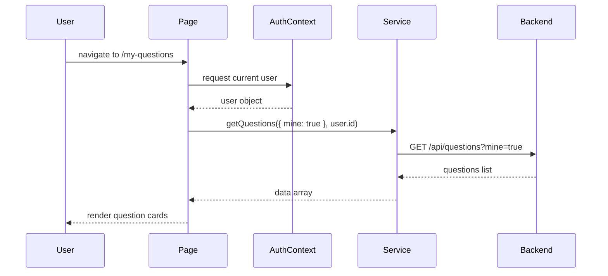

# Brief: My Questions Page

## Purpose

The My Questions page shows the authenticated user's own forum questions.
It provides a personalized view of the user's contributions and links to question details.

## Location

- Frontend page component: `frontend/src/pages/MyQuestions/MyQuestions.jsx`
- Route path: `/my-questions`
- Route registration: `frontend/src/App.jsx`
- Protected route: only accessible when the user is authenticated

## What this page does

- Loads the current user from `AuthContext`.
- Calls `getQuestions({ mine: true }, user.id)` to fetch only questions created by the current user.
- Displays a loading state while data loads.
- Shows an empty state if there are no questions.
- Renders a card list of authored questions with metadata.
- Provides a button to create a new question at `/questions/ask`.

## Key frontend behavior

- `useEffect` triggers on `user.id` change and calls `fetchData()`.
- `fetchData()` sets `loading` and fetches data safely.
- If the call fails, `questions` becomes an empty array and the error is logged.
- Each question card navigates to the question detail page: `/questions/${q.questionHash || q.id}`.
- Avatar display supports either a URL or a generated fallback with initials.

## Data flow

```mermaid
flowchart TD
  A[User opens /my-questions] --> B[ProtectedRoute checks auth]
  B --> C[MyQuestions page mounts]
  C --> D[AuthContext provides current user]
  D --> E[fetchData() calls getQuestions({ mine: true }, user.id)]
  E --> F[apiClient.get('/api/questions?mine=true')]
  F --> G[Backend GET /api/questions handles filter]
  G --> H[Response returns user-owned questions]
  H --> I[MyQuestions stores questions and renders cards]
```

## Actual code details

### `MyQuestions.jsx`

- Uses `useAuth()` to obtain `user`.
- Uses `useCallback` for `fetchData()` to avoid stale closures.
- Builds `backendUrl` from `VITE_API_URL` to resolve avatar paths.
- Displays one of three states:
  - loading: `Loading...`
  - empty: `No questions found`
  - data: question cards

### Question card contents

- title
- content preview (first 180 characters)
- reply count
- created date
- author first/last name
- avatar or initials fallback
- `YOURS` badge

## Backend integration

### Frontend service

- `frontend/src/services/core/question.service.js`
- `getQuestions(filters = {}, userId = null)`
- Adds `mine=true` query parameter when `filters.mine` is true and `userId` is present.

### Backend route

- `backend/src/api/questions/routes/question.routes.js`
- `GET /api/questions`
- Authenticated route via `authenticateUser`
- Supports query filters including `mine`

### Backend logic

- `backend/src/api/questions/controller/question.controller.js`
  - `mine: mine === "true"`
  - passes `userId` to `getQuestionsService`
- `backend/src/api/questions/service/question.service.js`
  - if `mine` is true, adds `q.user_id = ?` filter
  - returns only questions authored by the current user

## User experience

- The page is a private dashboard for the user's contributions.
- It encourages continued participation with a `+ New question` button.
- Clicking a card opens the question details page.
- The UI uses consistent styling and avatar behavior with other pages.

## Why this page matters

- It gives users ownership over their content.
- It helps them manage, review, and revisit their published questions.
- It reinforces the authenticated experience by showing only personal data.

## Diagram: sequence



## Implementation checklist

- [x] Page is mounted on `/my-questions`
- [x] Protected route requires authentication
- [x] Uses `AuthContext` to get current user
- [x] Calls `getQuestions({ mine: true }, user.id)`
- [x] Handles loading, empty, and list states
- [x] Navigates to details and ask-new-question pages
- [x] Displays author avatar or fallback initials

---

This brief explains how the My Questions page works and how it integrates with the question list API.
